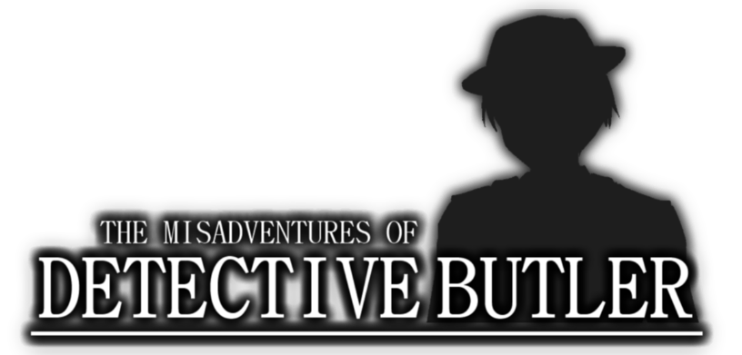

__The Misadventures of Detective Butler__ is a murder mystery (mis)adventure game series featuring the titular character Detective Butler and his sidekick Gilligan solving various mysteries.

The first game in the series, __Maiden Voyage Murder__, is a visual novel without choices, depicting the initial meeting between Butler and Gilligan during a summer cruise gone wrong.

The second game, __The Serial Murders__, is a 3D exploration game where you can actively investigate, interrogate, and confront various culprits in a city filled with crime as Butler and Gilligan hunt down a dangerous serial killer.

